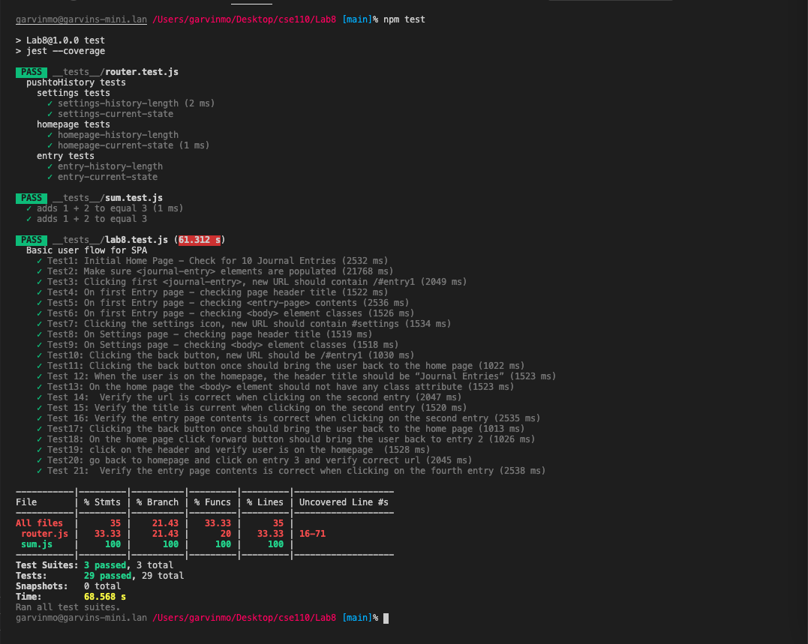

# Lab8_Starter
## Lab Partners
- Garvin Mo Zhen
- Cory Huynh
  
## Check your understanding q's (FILL OUT)
1. In your own words: Where would you fit your automated tests in your Bujo project development pipeline? (just write the letter)

   **1**
2. Would you use a unit test to test the “message” feature of a messaging application? Why or why not? For this question, assume the “message” feature allows a user to write and send a message to another user.

    No, testing the "message" feature as a whole would involve too many individual components that interact with each other like typing, sending, receiving, etc.
3. Would you use a unit test to test the “max message length” feature of a messaging application? Why or why not? For this question, assume the “max message length” feature prevents the user from typing more than 80 characters

    Yes, because testing the "max message length" is one individual feature that doesn't depend on the rest of the application. It is quick to execute and changing the max length of the message would not affect other non-related unit tests.
4. What do you expect to happen if we run our puppeteer tests with the field “headless” set to true?

    If we run puppeteer tests with the "headless" set to true, then it will run tests without the browser UI. In other words, it runs without Chromium's UI popping up.
5. What would your beforeAll callback look like if you wanted to start from the settings page before every test case?

    Without using goto, we would tell jest puppeteer to click on the settings cog image after loading into the home page. i.e. add the following code at the end of the beforeAll callback.
    ~~~
    await page.$eval("img", element => element.click());
    ~~~

## Running 'npm test'

